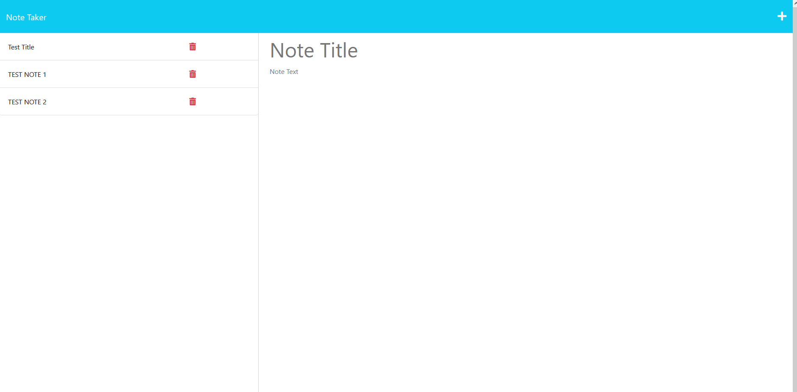

# Note Taker

## Description

Note Taker is a web application that creates,stores,and deletes notes. This project was made to provide an easy-to-use web based tool for note taking. This project eliminates having to use a seperate software to take and store notes.

This project taught me how to use Node.js and Express to build a website back-end, set proper routes, and use Heroku to deploy a web application.

## Table of Contents

- [Installation](#installation)
- [Usage](#usage)
- [Credits](#credits)
- [License](#license)
- [Contributing](#contributing)
- [Tests](#tests)
- [Questions](#questions)

## Installation

No installations are required to use this web application.

## Usage

[Deployed Webpage](https://note-keeper-app1.herokuapp.com/)

To use this application a user can will click the "get started" button. Then a user can enter a name and text for a note. From there the user will select the save button to save the note. The user can then delete, edit, or create new notes as desired by using the buttons on the web application.

 

## Credits

[Heroku](https://docs.npmjs.com/)

[Node.js](https://nodejs.org/en)

[Express](https://expressjs.com/en/guide/routing.html)

## License

This application is licensed under the [MIT](https://opensource.org/licenses/MIT).

## Contributing

If you would like to contribe to this project contact me through the email found in the Questions section.

## Tests

N/A

## Questions

[GitHub](https://github.com/josh4got)

If you have any questions, please contact me at joshbottied1@gmail.com
